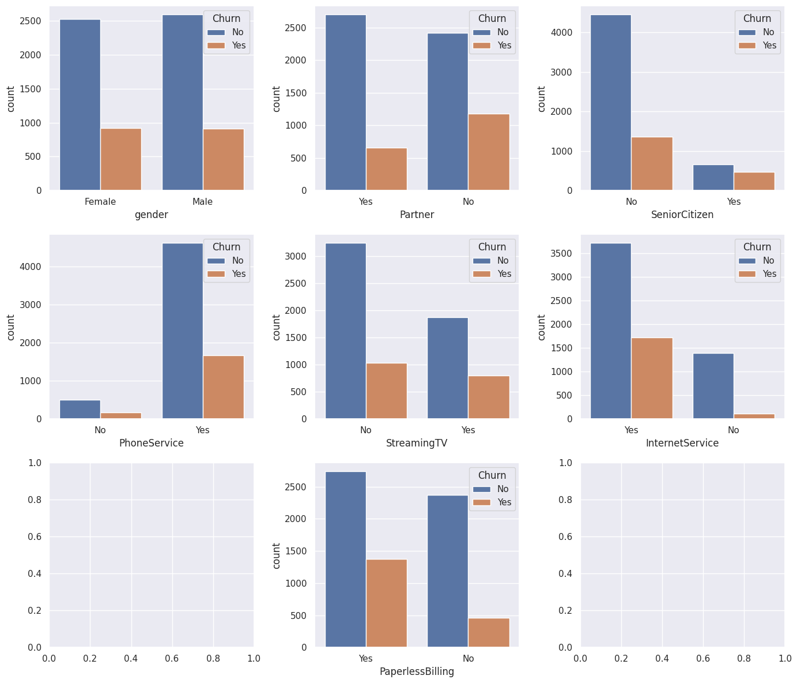
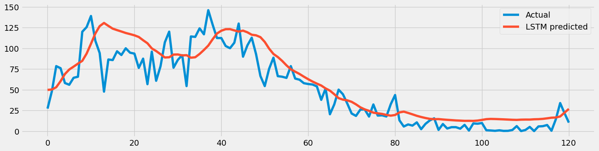

# Zein Data Science Portofolio

### Education
- Science Class @ SMAN 11 GARUT
- IT Students @ Institut Teknologi Garut
- Bangkit Alumni  Machine Learning Path

## Project
### [Citizen Feedback App](https://github.com/Zeinayyy/Citizen_Feedback_App)

- Sebuah Aplikasi untuk Memberikan Feedback ke Pemerintah
- Powered by Machine Learning Algorithm (NLP & BERT)
- Bisa Mengklasifikasi mana isu yang Urgent dan non-urgent dengan AI dan Analisis Sentimen
- Dataset Bersumber dari Twitter  (Scrapping) dengan jumlah lebih dari 1000

### [Customer Churn Detection](https://github.com/Zeinayyy/Churn-Detection)
Model ML ini mendeteksi Customer Churn, Deteksi churn mengacu pada proses mengidentifikasi pelanggan atau pengguna yang cenderung meninggalkan produk atau layanan suatu perusahaan. "Churn" sendiri merujuk pada kehilangan pelanggan atau pengguna, yang dapat terjadi karena berbagai alasan seperti ketidakpuasan, persaingan dengan produk lain, perubahan kebutuhan pelanggan, atau faktor-faktor lain yang membuat mereka beralih ke solusi atau layanan yang lain.

### [Sunspot Prediction dengan menggunakan CNN - RNN](https://github.com/Zeinayyy/Sunspot-Prediction/tree/main)
Ini adalah Model machine learning untuk memprediksi Sunspot dengan Convolutional Neural Network dan Recurrent Neural Network, Prediksi Sunspot mengacu pada ramalan atau perkiraan aktivitas matahari, khususnya kejadian dan karakteristik bintik-bintik matahari di permukaan Matahari. Bintik matahari adalah fenomena sementara di fotosfer Matahari yang muncul sebagai titik yang lebih gelap dibandingkan dengan area sekitarnya. Mereka disebabkan oleh aktivitas magnetik Matahari dan sering terjadi dalam siklus yang dikenal sebagai siklus surya, yang berlangsung sekitar 11 tahun.

### [Bisindo Gesture Classification Using SSDMOBILENET V2 and Tensorflow Object Detection API](https://github.com/Zeinayyy/Klasifikasi_BISINDO/tree/main)
Dibuat dengan menggunakan Model pra-latih SSDMOBILENET V2 dan API Tensorflow Object Detection, Model ini memungkinkan untuk mengklasifikasi gesture alfabet bahasa isyarat Bahasa isyarat Indonesia Secara Langsung

